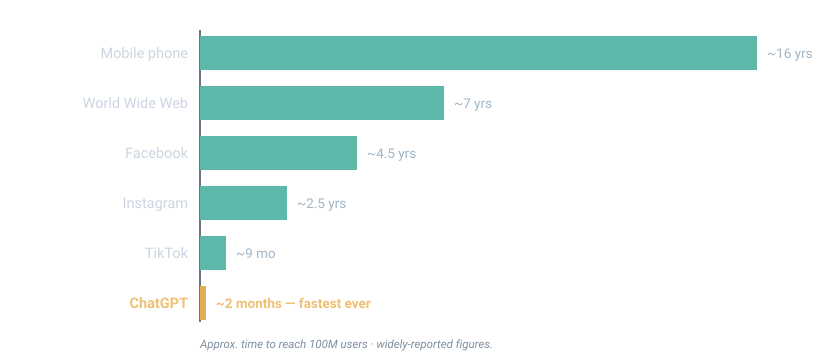
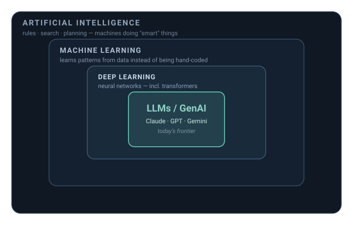
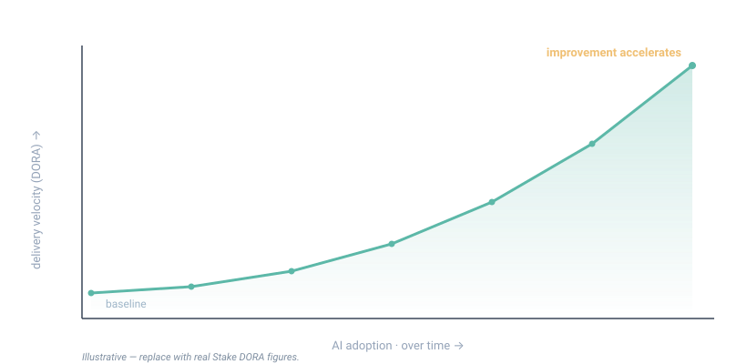
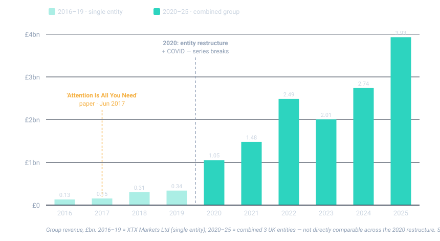
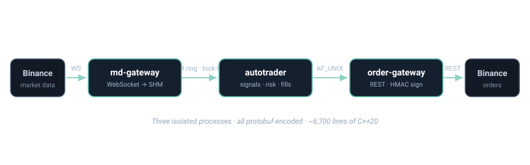
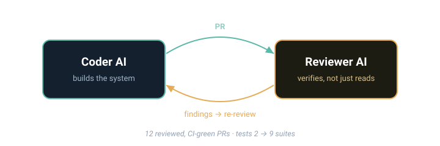

<!-- _class: cover -->
<!-- _paginate: false -->
<!-- _footer: '' -->

# Using AI

## Where it actually is in trading — and what happened when I tried it myself

Prepared for Auros · June 2026

<!--
Speaker: A calm open. The title says it plainly.
-->

---

overview

## What I'll cover

1. **The pace of change** — unprecedented in magnitude and velocity, with implications across the whole economy
2. **What software engineering looks like now** — measuring the speed-up (Stake / DORA), and why great people matter more
3. **Optiver & XTX** — how serious trading firms are actually using AI
4. **My experiment** — a live Binance bot, built to test the thesis myself

<!--
Speaker: The roadmap. Four beats: general → specific → personal. No preamble beyond this.
-->

---

<!-- _class: section -->
<!-- _paginate: false -->

# Part 1
## The pace of change

<!--
Speaker: Set the scale before anything else.
-->

---

Part 1 · the pace

## Unprecedented — in magnitude and velocity

- **Velocity like nothing before** — ChatGPT reached 100M users in ~2 months, the fastest in history
- **General-purpose** — code, law, medicine, markets — so the implications run **across the whole economy**

Approx. time to 100M users; widely-reported figures.

<!--
Speaker: Point 1. Lead with the scale — nothing has emerged at this magnitude AND this velocity together. Then the economic reach: this isn't a dev-tools story, it's an everything story.
-->

---

## The tools at the frontier

- **Claude Code** — terminal/IDE agent; writes the majority of Anthropic's own code
- **OpenAI Codex** — cloud agent, runs tasks in parallel
- **Cursor** — AI-native IDE (firm-wide at Coinbase, Optiver)

- **GitHub Copilot (agent)** — issue → pull request
- **Gemini CLI / Amazon Q** — agents in the terminal & cloud
- **Devin (Cognition)** — autonomous software engineer

> These aren't autocomplete. They read a codebase, plan, edit across files, run the tests, and open the PR.

<!--
Speaker: Evidence of the velocity — none of these existed in this form a couple of years ago. The unit of work went from "a suggestion" to "a task."
-->

---

## AI vs ML vs LLMs — the same family

So we use words the same way: "AI" is the field, "ML" learns from data, "deep learning" is neural nets (incl. transformers), "LLMs/GenAI" are the frontier. Trading uses the whole stack — not just chatbots.

<!--
Speaker: Defuse jargon fast — keep this to ~30 seconds.
-->

---

Part 1 · the proof

## It's already writing the code

> From ~a quarter of new code at mainstream firms to **~90% at the AI-native frontier** (Anthropic, via Claude Code) — already, with humans on review.

<!--
Speaker: Concrete proof it's here. Baseline, not frontier.
-->

---

<!-- _class: section -->
<!-- _paginate: false -->

# Part 2
## What software engineering looks like now

<!--
Speaker: From the macro to the daily reality of building software.
-->

---

The shift

## Engineers are becoming agent-managers

- The work is moving from **writing code** to **directing and reviewing** the agents that write it
- It's a step up the abstraction ladder — much like the move from **assembly to C++**
- The teams leaning in are shipping in a fraction of the time

<!--
Speaker: Observation, not instruction — the role is changing across the industry (architect / agent-manager).
-->

---

What it looks like now · measuring it

## We can measure the speed-up — Stake & DORA

- At **Stake**, we tracked the AI rollout with **DORA metrics** — and delivery velocity climbed, **faster as adoption deepened**
- DORA measures delivery as an **outcome, not a feeling** — so you can *prove* the speed-up, not just claim it

DORA: deploy frequency · lead time · change-fail rate · time-to-restore. Curve illustrative — replace with your real before/after numbers.

<!--
Speaker: Drop in your real Stake DORA numbers (deploy frequency before/after, lead-time cut). First-person credibility — you did this. The curve is the shape: improvement that accelerates as the team leans in.
-->

---

What it looks like now · people

## AI is an amplifier — so great people matter more

- AI multiplies what a strong engineer can do — one good person now ships like a small team
- But it amplifies **judgment too**: weak calls ship faster, and more confidently
- And everyone's suddenly **managing agents** — a real transition, and some won't make the leap

> The tooling is the easy part. Great people — and their judgment — are the moat.

<!--
Speaker: The key point: AI raises the ceiling for your best people and the risk from your weakest. So you hire and keep great people — AI doesn't replace that, it raises the stakes on it.
-->

---

The economics of code

## Legacy is only worth it if it pays

- AI makes legacy code far cheaper to **read, migrate and modernise** — the grind is largely automatable now
- But **greenfield vs. legacy applies to AI too** — agents thrive on a clean rewrite and fight a tangled brownfield
- The only code worth its legacy overhead is code that **makes money** — and with rewrites now cheap, firms will **throw the rest out**
- Optiver's tell: rather than nurse old systems, the energy went into **new systematic trading, built fresh**

<!--
Speaker: The "code = P&L" idea, as an observation. And the greenfield-vs-legacy point: AI is far stronger on a clean build than on a tangled legacy base — which makes "rewrite fresh" even more attractive. Illustrate, don't prescribe.
-->

---

What the winners have in common

## The substrate that makes it work

- **Multi-agent code review** — a panel, not one model; different models catch different bugs
- **Skills over chats** — reusable tools, not one-off prompts
- **Monorepos + real tests** — so agents see the whole picture and can't break things quietly

### And it reaches everyone
**Data** is the moat, and the clean-up is unavoidable — though **AI can help.** **Legal, finance, HR** are on the same curve. It's a firm-wide story.

<!--
Speaker: The practical "how," compressed. Multi-agent review is the non-obvious one — and the thing my own experiment leaned on hardest.
-->

---

An unexpected dividend

## Ideas get tested without the queue

- Traders & researchers can **prototype and test ideas directly** — the "raise a ticket, wait for a dev" bottleneck fades
- Hypotheses go from **idea → tested in hours**, not sprints
- The irony: working with agents **forces better documentation** — they need the context, so it finally gets written
- Net effect: a **tighter loop between research and the market**

<!--
Speaker: The one the traders in the room will feel. This is exactly Optiver's strategy, next.
-->

---

<!-- _class: section -->
<!-- _paginate: false -->

# Part 3
## Case study: Optiver

<!--
Speaker: The centrepiece — my read from inside Optiver. Say verbally these are recollections.
-->

---

Case study · Optiver

## Optiver's strategy, in three lines

- **Time to market is the goal** — ship and adapt faster than the field
- **Developer productivity is the byproduct** — it follows from the goal; it was never the point
- **Remove the engineering bottleneck** — so traders & researchers can test ideas directly

<!--
Speaker: Anchor the whole section here. The order matters: they're chasing speed-to-market; productivity and self-serve research are consequences, not targets.
-->

---

Case study · Optiver Insider

## Backing it with real money

- When I left, Optiver was **only just starting** its AI journey
- Now: **major investment in systematic trading** — ~**€500M NTI** on the Austin desk at that time
- **~€100M** on a **private GPU cluster & data centre** — and **more is being spent this year**

My recollection / insider perspective — figures approximate and not independently verified.

<!--
Speaker: CONFIDENTIALITY — internal recollections; say only what you're comfortable sharing. The point: the time-to-market strategy is backed with serious capital.
-->

---

Case study · Optiver Insider

## "It won't work here." It worked.

- The objection everyone had: *"our engineering is too specialised — AI can't help us"*
- Then **AI-only connectivity** went **into production** for US cash trading — many markets, connected fast
- It cleared the **"ATR moral hazard"** that had stalled this work for years
- Today: **dedicated AI-enablement teams** with **partner-level sponsorship**

> Speed to market beat the "we're different" objection.

<!--
Speaker: CONFIDENTIALITY applies. The reversal — tell it with a beat. "Too specialised" got disproven once the goal was clearly time-to-market and the top sponsored it.
-->

---

Case study · Optiver & IMC Insider

## AI Apps Engineers, in the wild

- **Both Optiver and IMC** use **AI Apps Engineers** extensively
- Concrete wins: **faster triage** and **faster market re-entry** after issues
- Removes a **stressful, mundane on-call task** from humans — and **improves availability metrics**

> Faster re-entry is time-to-market by another name — and a horrible job got easier.

<!--
Speaker: The most relatable example: operational toil. Availability up, a painful job easier.
-->

---

Optiver isn't alone · XTX

## A closer look at XTX

- The early bet — **transformers on PCAP**, predict-not-race — built profits near Optiver's, on a far smaller team

Net profit (bars; Optiver from 2021, €→£ approx) + approximate headcount (lines). Markers: "Attention" paper (2017) &amp; COVID (2020). Sources: Companies House / press.

<!--
Speaker: Brief. The chart makes the point — comparable profits, very different headcount, with the 2017 paper and COVID marked. XTX is supporting evidence; Optiver is the case study.
-->

---

<!-- _class: section -->
<!-- _paginate: false -->

# Part 4
## I put my own thesis to the test

Can AI really cut time-to-market for a trading strategy?

<!--
Speaker: Shift to first person. I believed AI could lower time-to-market for a strategy — so I tried it, and tried to break my own thesis. Here's the honest journey.
-->

---

My experiment · 1

## From a prompt to a live trader

- **Plain-English prompts → a running system:** live market-data feed, signal logic, simulated fills, a live console dashboard
- The AI absorbed **all the plumbing** — WebSocket streams, REST order routing, HMAC signing, protobuf schemas, orchestration
- Which freed me for the only genuinely hard part — **finding edge** — not wiring up an exchange

> A working paper-trader on live Binance data — zero connectivity code written by hand.

<!--
Speaker: Step 1 — the thesis held: high-level prompts produced a real, multi-process scalper against live market data, with none of the plumbing written by me.
-->

---

My experiment · 2

## Then I made it hard on purpose

- I dictated real constraints: **C++20, multi-process, shared-memory IPC**
- Back came **three isolated processes** over a **lock-free SHM ring + Unix sockets**, all protobuf — ~**6,700 lines**
- With the details a senior quant dev adds: lot/tick rounding, IOC slippage caps, a **daily-loss kill-switch**, a regime-aware strategy

> Lock-free seqlock ring · 3 processes · protobuf · C++20 — all from prompts.

<!--
Speaker: Step 2 — I imposed genuine engineering constraints and got back genuine systems work, not toy code. The constraints didn't slow the real work; my focus stayed on strategy.
-->

---

My experiment · 3

## Two AIs, working against each other

- One AI **built**; a second **reviewed adversarially** — "verified, not just read": rebuilt under `-Werror` + sanitizers, traced the P&L by hand
- It caught **real money-safety bugs**: TLS off on the live order path, entry fees missing from P&L, an overfit backtest, an unhedged carry trade
- Across rounds → **12 CI-green PRs**; tests grew **2 → 9 suites**

> The bottleneck was never "can AI build it?" — it was "is it correct and safe?" The adversarial loop is what closed that gap.

<!--
Speaker: Step 3 — the punchline. A second AI reviewing the first, adversarially, is where production quality came from. It caught money-safety bugs the coder shipped. My role shifted from author to director — setting constraints and arbitrating between two AIs.
Extra points to sprinkle: the AI was honest not hype (at small size, fees dominate the edge — viable scalping needs a lower-fee venue); each review round hardened the codebase, so later changes were safer by construction.
-->

---

## Where this leaves us

- **Ideas reach the market faster** — the prize Optiver is chasing
- **Productivity follows** — more output per engineer, as a byproduct
- **The boring toil gets handled** — triage, re-entry, connectivity

- **Trust is the new bottleneck** — adversarial review is the cheapest way to buy it
- **Legacy stops being a prison** — rewrite cheaply, keep only what pays
- **It's firm-wide** — not just engineering

<!--
Speaker: Observations, not instructions — what's on the table now, shown through what's already happening and what I saw first-hand.
-->

---

<!-- _class: lead -->
<!-- _paginate: false -->
<!-- _footer: '' -->

# Building got cheap. The work is trust.

## AI can take an idea to market remarkably fast — the bottleneck shifts to making it correct and safe. That's solvable too, and the tools are here for anyone.

<!--
Speaker: A calm close, drawn straight from the experiment. State it, pause, open it up for discussion.
-->

---

<!-- _class: section -->
<!-- _paginate: false -->

# Appendix
## Evidence & references

<!--
Speaker: Reference material for Q&A — three buckets. Leave up while questions come.
-->

---

Appendix A

## TradFi firms spending big

- **XTX** — ~£3.9bn revenue on ~260 staff; 25k GPUs, transformers
- **Citadel Securities** — AI spend rising; entered **crypto market-making** (Feb 2025)
- **Jane Street** — **$6B** CoreWeave AI-compute commitment
- **Bridgewater** — **$2B** "AIA" ML fund

- **Two Sigma** — DL on unstructured data
- **Renaissance** — decades of statistical ML
- **Hudson River Trading** — sequence models / LLMs on market data
- **Man AHL / JPMorgan (LOXM)** — production ML in execution

Sources in <code>sources.md</code>. Verified public unless flagged.

---

Appendix B

## Economic trends

- **AI capex** — ~**$500B+/yr** hyperscaler spend (2026)
- **Code adoption** — Google ~25%+, GitHub 46%, Coinbase 50% target
- **Productivity** — Copilot +55% task speed; Anthropic 81% median time saved
- **Enterprise** — Amazon Q **$260M**; Klarna −40% cost/txn; IBM AskHR −40%

- **R&D** — AlphaFold (Nobel), GNoME (2.2M materials), AlphaChip
- **Autonomy** — Waymo 450k rides/wk; Amazon 1M robots; Devin @ Nubank/Goldman
- **Markets** — AI-agent & automated-trading TAMs growing 40%+ CAGR

Company-reported / press / analyst; several 2026 figures are forecasts. See <code>sources.md</code>.

---

Appendix C

## Crypto / DeFi firms embracing AI

- **Wintermute** — ML risk/MM; ~$5B/day
- **B2C2** — vector/time-series ML; $2T+ volume
- **Keyrock · Flowdesk** — ML across 85+ venues; 1M+ orders/day
- **FalconX · DWF · Amber** — LLM copilots; autonomous trading agents
- **GSR · Jump · Cumberland** — DL/RL/LLMs at scale

- **Exchanges going agent-native** — Coinbase AgentKit, Kraken CLI (MCP), OKX Agent Trade Kit, Binance AI
- **On-chain agents** — Virtuals (~$479M Q1), Bittensor (~$43M Q1), ai16z/ElizaOS — *real revenue, lots of hype* M

Most market-maker internals are proprietary — ML use sourced from statements/jobs; specifics are inference.

---

## Sources & method

- **My experiment (Part 4):** first-hand — an AI-built C++20 crypto scalper, adversarially reviewed by a second AI
- **Optiver / IMC (Part 3):** my own insider perspective — directional, not public disclosures
- **XTX:** Companies House (`09415174`, `12300034`, `12832334`); FX News Group; Finance Magnates; xtxmarkets.com
- **TradFi / Economy / Crypto:** CoinDesk, Bloomberg, Fortune; Anthropic & GitHub research; AWS; OpenAI; DeepMind; Messari; 1kx

Full URL list in <code>sources.md</code>. Key: unbadged = sourced · I inference/insider · M hype-flagged. Verify headline figures before presenting.

<!--
Speaker: Close on rigour. Part 3 is recollection; Part 4 is first-hand.
-->
