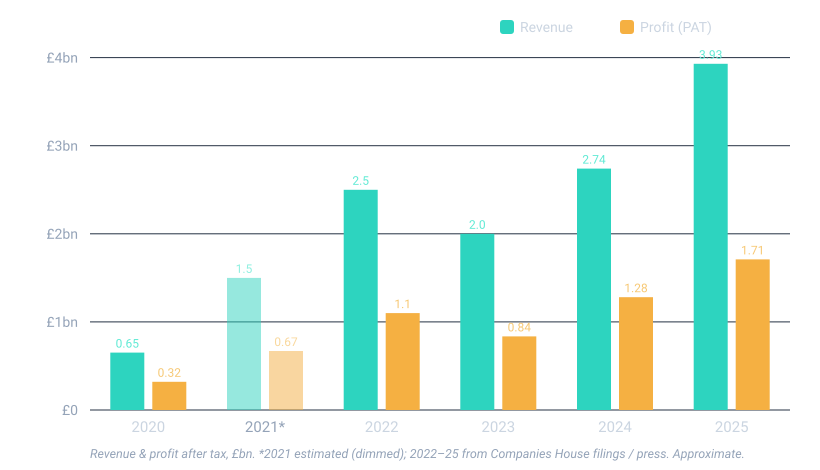
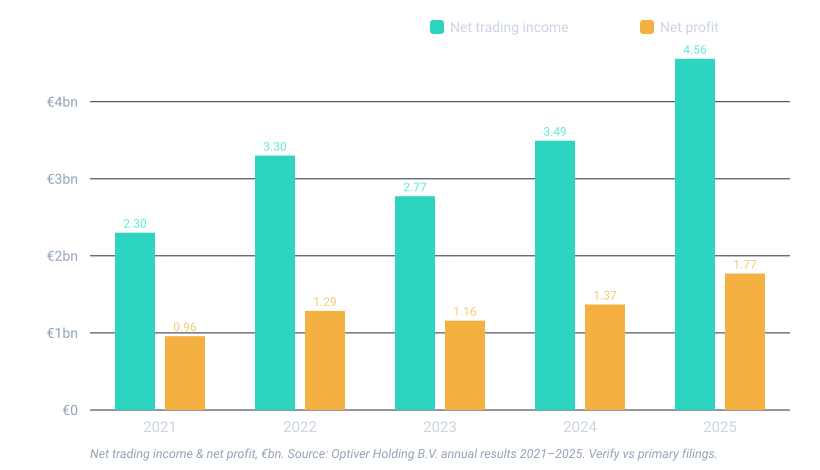
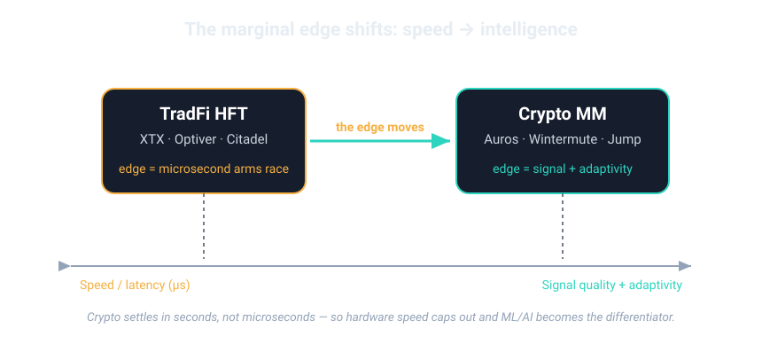

<!-- _class: lead -->
<!-- _paginate: false -->
<!-- _footer: '' -->

Reference points: XTX · Optiver · Citadel

# AI in High-Frequency Trading

## What the quant giants are doing — and what it means for Auros

**Rohan Smith**  ·  13 yrs Optiver  ·  AI @ Stake
Draft for internal discussion · June 2026

<!--
Speaker: Open by naming the room's instinct: "we're a crypto market maker — why care what a London FX firm does?" Answer: the firms compounding hardest right now are doing it with AI, and the lessons port directly to us. ~45 seconds, high energy.
-->

---

## Why me, why this room

- **13 years at Optiver** — market making, low-latency systems, and the AI shift seen from the inside
- **AI at Stake** — shipping AI into a live retail trading product
- I've watched the same playbook run at a TradFi giant *and* a fintech

### The hook

Auros's own DNA is **part-Optiver** — founder **Ben Roth** was an Optiver derivatives trader.

So this isn't "TradFi vs crypto." It's the **same engineering culture**, asking the same question one cycle later.

Source: Paradigm interview with Ben Roth; auros.global. Verified

<!--
Speaker: Establish standing fast, then disarm the "TradFi doesn't apply to us" objection with the Ben Roth fact. That buys permission for the whole talk.
-->

---

## Three things to leave with

### A · It's here

AI is now table-stakes in quant trading. <strong>Your competitors are already spending.</strong>

### B · Code = P&amp;L

Legacy code only matters <em>if it's making money.</em> AI collapses the cost of rewriting the rest.

### C · People

Engineering becomes a <strong>different skill</strong>. The best people matter <em>more</em> — or you just accelerate bad outcomes.

 

Everything else in this deck is evidence for these three.

<!--
Speaker: Plant the three flags now and tell them you'll return to each. The repetition is deliberate — these are the only three things they need to remember.
-->

---

<!-- _class: section -->
<!-- _paginate: false -->

# Part 1
## The competitive landscape — AI *is* the new arms race

<!--
Speaker: Transition. Next we quantify what XTX, Optiver and Citadel are actually spending and building — with numbers, not vibes.
-->

---

## The reference set — and why these three

- **XTX Markets** — the purest "AI-first" non-bank market maker
- **Optiver** — incumbent options MM, going all-in on AI (my home turf)
- **Citadel Securities** — the scale benchmark... now **entering crypto**

**Plus crypto-native peers** for calibration:

- Jump Crypto · Wintermute · GSR · Cumberland

**Why these:** they sit on the same spectrum Auros does — principal, systematic, technology-bound. Their AI choices preview ours.

<!--
Speaker: Frame the comparison set as a spectrum, not "them vs us." Flag the Citadel teaser — you'll detonate it on slide 9.
-->

---

## XTX — the operating model

- **Non-bank principal market maker** — no external capital, no discretionary traders
- **~$250bn traded/day**, 50k+ instruments, #1 non-bank FX liquidity provider
- **Fully systematic**: edge = *price prediction at scale*, not client flow
- Founder **Alexander Gerko**: *out-predict, don't out-race*

### The contrarian bet

While rivals bought microwave towers, XTX bought **GPUs and researchers**.

Latency still matters — but their moat is **model quality on enormous data**.

Sources: XTX Markets; FX-Markets; Wikipedia (Alex Gerko). Verified

<!--
Speaker: This one firm is the whole deck's thesis — the marginal dollar moved from speed to intelligence. Gerko is a maths-olympiad quant; the firm is ~260 people. Tee up the scale chart next.
-->

---

## XTX — the bet, quantified

- **€1bn+ GPU data centre** in Kajaani, Finland — ~**25,000 GPUs**
- **~£6.6M profit per employee** (2025) on ~260 staff

- Filed publicly at **Companies House** — *not HMRC* (that's only tax)
- Entities: XTX Markets Ltd `09415174`, Technologies `12300034`

Companies House; Data Centre Dynamics; A-Team Insight. Verified · figures approximate.

<!--
Speaker: Land two numbers hard — €1bn on compute, and £6.6M profit per head. The second is the punchline: that is what AI-leveraged headcount looks like. Correct HMRC→Companies House lightly; it signals rigour. 2021 bar is estimated, everything 2022+ is from filings/press.
-->

---

## XTX — what to copy, what's myth

<h3 style="color:#34d399">Real &amp; copyable</h3>

- **Transformers in the live stack** (their words: "transformers and variants") Verified
- Moat = **compute + data + a few elite researchers**
- Train on **raw market-data captures (pcaps)** Inference

<h3 style="color:#f87171">Myth to avoid on stage</h3>

- *"XTX was built on Google's 2017 'Attention Is All You Need'"* Myth
- XTX was founded **2015 — before the paper.** Transformers came later, as one tool among many.

XTX job specs / tech blog; arXiv 1706.03762. Saying the dates yourself protects you from the one quant in the room who knows them.

<!--
Speaker: This slide is a credibility play. If you assert the transformer-origin story and someone knows XTX predates the paper, you lose the room. Say it yourself first. "pcaps for training" is a reasonable inference, not confirmed — keep the badge on it.
-->

---

## Optiver — record results, then reinvested

- A 1986 options market maker posting **record net trading income** — ~€4.5bn in 2025
- The point: this AI build-out is funded **from strength**, not desperation

Optiver Holding B.V. annual results 2021–2025. Verified

<!--
Speaker: Frame the spend that follows as investing from a position of strength — record results ploughed back into AI and systematic trading. Sets up the "all-in" slide.
-->

---

## Optiver — the incumbent going all-in

- **AI Lab** — standalone, foundational-model + LLM research
- **Cursor rolled out firm-wide** to engineering Verified
- **US systematic-trading push** + dedicated **GPU compute**
- **AI-coded connectivity libraries** Insider view
- **AI in the trade loop** — signal/alpha research, plus ops & compliance
- FPGA + AMD for the latency tier

### Read-through

A **1986** options market maker is re-tooling **end-to-end** — research, engineering, *and* back office.

If the incumbent feels this much pressure, so does everyone adjacent.

optiver.com; eFinancialCareers (AI Lab); AMD newsroom; LinkedIn (Cursor). Internal-sourced items = my perspective — confirm what's shareable.

<!--
Speaker: Some of this is my insider read — flag that verbally and keep specifics general. The point for Auros is the BREADTH: not a model here and there, but research + engineering + ops changing at once.
-->

---

## Citadel Securities — the shot across the bow

- Two entities, don't conflate: **Citadel** (hedge fund) vs **Citadel Securities** (market maker)
- Securities: **AI spend rising**, framed as a productivity multiplier; ML in the business for *years*
- **Feb 2025: building a crypto market-making business** Verified

### Why Auros should care

The most operationally feared MM on earth is bringing **TradFi-grade AI + capital into your venues.**

The question stops being *"should we?"* and becomes **"how fast?"**

CoinDesk (crypto MM, Feb 2025); Bloomberg (AI spend, 2026). Verified

<!--
Speaker: This is the urgency peak of Part 1. Citadel entering crypto market making is the single most motivating fact for this room. Say it, then pause and let it sit.
-->

---

## The crypto natives aren't waiting either

- **Wintermute** — public about ML for signals & pricing across horizons
- **Jump Crypto** — quant/HFT heritage; AI + big-data forecasting
- **GSR · Cumberland (DRW)** — TradFi quant DNA, now in crypto

70%+
of CEX flow on major venues is already algorithmic.

 

The baseline is automated. AI is the **next** layer of edge on top of it.

Company statements; Kaiko-cited industry data. ML use Verified · "LLMs trading live at scale" — not yet, anywhere.

<!--
Speaker: Round out the landscape so it isn't only TradFi. Your peers already use ML; the open frontier is the AI layer above classic quant. Sets up Part 2.
-->

---

## Part 1, in one line

> The firms compounding fastest — TradFi *and* crypto — are the ones spending on AI. The gap doesn't stay still; **it compounds.**

- Compute, data and elite people buy **durable** edge
- Auros's competitors are funding all three **right now**

<!--
Speaker: Bridge. "OK, the threat is real — but crypto isn't equities, so where does AI actually pay off for US?" That question is Part 2.
-->

---

<!-- _class: section -->
<!-- _paginate: false -->

# Part 2
## Where AI actually pays off in *crypto* market making

<!--
Speaker: Now make it concrete and crypto-native — not a copy-paste of the TradFi playbook.
-->

---

## Crypto ≠ TradFi — the edge moves

- **24/7**, no close → models must learn *online*, never "refit overnight"
- **Fragmented venues, no consolidated tape** → it's a routing / aggregation problem
- **On-chain + mempool, funding rates, perps** → signals TradFi simply doesn't have

DWF Labs; Gravity Team; CoinGecko CEX/DEX 2026. Analytical synthesis.

<!--
Speaker: The reframe. In equities the marginal edge is microseconds; in crypto, settlement is seconds, so speed caps out and the edge becomes signal quality and adaptivity. That tilts the field toward AI/ML, not hardware — good news for a firm with great people.
-->

---

## The AI opportunity map for Auros

### Signals (alpha)

On-chain & mempool flow · whale / liquidation cascades · **funding-rate regime** prediction · cross-venue dislocations

### Execution

ML **routing / aggregation** across 60+ venues · slippage reduction · adaptive quoting across 24/7 regimes

### Risk

Fast **regime detection** · dynamic hedging · leverage-cascade early warning

### Leverage (non-trading)

LLM **research copilots** · venue-integration code · ops / monitoring / post-trade

<!--
Speaker: This is the menu. Highlight which items are crypto-native (funding rates, on-chain) — those are an asymmetric moat a TradFi entrant can't easily copy. Anchor to Auros's real surface area: 60+ venues, perps, DeFi.
-->

---

## An honest maturity check

### Real today

- ML for signals, pricing, routing, risk
- LLMs for **research, code, ops** leverage

### Not real yet (anywhere)

- "LLM / AGI trading live at scale"
- Fully autonomous strategy discovery

> Credibility over hype. Promising *less* than the vendors is how you keep the room's trust — and the board's.

<!--
Speaker: Deliberately deflate the hype. This protects you and makes the asks later in the deck believable.
-->

---

<!-- _class: section -->
<!-- _paginate: false -->

# Part 3 · Message B
## "Legacy code only matters if it's making money"

<!--
Speaker: Shift from "where AI trades" to "how AI changes our engineering." Two big claims left — code, then people.
-->

---

## Judge code by P&L, not by craft

- The value of a codebase is **the P&L it produces** — not its age, its elegance, or how hard it was to write
- AI has **collapsed the cost of rewriting** the parts that aren't differentiating
- So a romantic attachment to legacy is now **a cost**, not a virtue

> If a system isn't making money or protecting money, it's a **candidate for AI to rebuild or replace** — cheaply.

<!--
Speaker: This is the most provocative claim — say it plainly and own it. The caveat lands next slide so you're not reckless: P&L-critical code still demands maximum rigour.
-->

---

## The cut: P&L-critical vs commodity plumbing

<h3 style="color:#34d399">Makes / protects money</h3>

Signal & alpha models · pricing · risk & hedging · latency-critical execution

→ **Your best humans + AI copilots. Maximum rigour. Protect and invest.**

<h3 style="color:#2dd4bf">Commodity plumbing</h3>

Venue **connectivity adapters** · glue / ETL · dashboards · boilerplate · most "legacy"

→ **AI-generate and maintain. Don't romanticise. Rewrite cheaply.**

Proof point: Optiver is already shipping **AI-coded connectivity libraries** Insider view — connectivity is undifferentiated, so let AI own it.

<!--
Speaker: Optiver treating exchange connectivity as AI-ownable is the concrete proof. The two-box framework gives the room a decision rule they can apply on Monday.
-->

---

## Apply it to Auros

- You integrate **60+ venues** (Python / C#) — adapter code is largely **commodity plumbing**
- Prime territory for **AI-generated + AI-maintained** connectivity, with humans on review
- That frees scarce senior people to defend the **P&L-critical** core: signals, pricing, risk

A practical first move: a **"P&amp;L vs plumbing" audit** of the codebase. Tag every system. Point AI at the plumbing; ring-fence the core.

Auros venue count & stack: AWS Nitro Enclaves case study; Blockonomi. Verified

<!--
Speaker: Make it actionable and specific to their stack. The audit is a low-risk, high-signal first project leadership can say yes to without betting the firm.
-->

---

<!-- _class: section -->
<!-- _paginate: false -->

# Part 4 · Message C
## Engineering becomes a different skill — so people matter *more*

<!--
Speaker: The final claim. This is the one most likely to be resisted by an eng-heavy room, so handle it with respect.
-->

---

## The skill shift

**From** → writing every line
**To** → **specifying, reviewing, orchestrating** AI

- The bottleneck moves to **judgment and taste**
- Reading code critically > typing it fast
- System design & problem framing become the scarce skills

### Why this is hard

The engineers who thrived on hand-crafting are **not automatically** the ones who thrive at directing and verifying.

It's a **retraining** problem, not just a tooling rollout.

<!--
Speaker: Normalise that this is a transition with winners and losers among existing staff. Frame it as a skills change, not a headcount cut — that keeps the room on side.
-->

---

## The danger: AI accelerates *poor* outcomes

> Mediocre engineering + AI = **fast, confident, wrong code at scale.**

- In a market maker, wrong-at-scale = **P&L events and risk events**, not just bugs
- AI removes the friction that used to *slow bad code down*
- Velocity is only a virtue when **judgment gates it**

<!--
Speaker: This is the line the user wants to land — say "accelerate poor outcomes" verbatim. The friction point is subtle and important: weak engineers used to be slow; now they're fast and confident. That's more dangerous, not less.
-->

---

## Therefore: the best people matter *more*, not less

### Hire / keep

Raise the bar. One great reviewer prevents a dozen AI-shaped disasters.

### Gate

Strong review, tests and guardrails on anything near the money or the risk.

### Invest

Tooling + training so good people go faster — not so weak code ships faster.

 

Auros is already **~70% engineers** — that density is an asset. Sharpen it; don't dilute it.

<!--
Speaker: Close the people argument by turning Auros's eng-heavy makeup into the reason they can win this — provided they protect quality.
-->

---

## Where this leaves us

**A · It's here** — competitors (incl. Citadel) are spending on AI *now*

**B · Code = P&L** — let AI own the plumbing; defend the money-making core

**C · People** — the best engineers matter more; quality gates the velocity

### Four moves for Auros

1. A **compute / AI plan** — don't get out-spent on capability
2. A **"P&amp;L vs plumbing" code audit**
3. **AI tooling** for engineering (with guardrails)
4. A **talent & review bar** for the AI era

<!--
Speaker: Recap the spine, then hand over four concrete, fundable asks. End on momentum, not a summary.
-->

---

## Risks & honest caveats

- **Hype risk** — most "AI trading" claims are marketing
- **Model risk** — silent failure, overfitting, regime breaks
- **Security / custody** — AI-written code near keys & settlement

- **24/7 ops discipline** — online models drift; monitoring is non-negotiable
- **Confidentiality** — some comparisons here are my read of Optiver; treat as perspective, not gospel

<!--
Speaker: Showing you see the downside is what makes the upside credible. Reiterate the confidentiality framing so the room knows you're being careful with a former employer's information.
-->

---

## Appendix · sources & method

- **XTX**: Companies House (`09415174`, `12300034`); DCD & A-Team (Kajaani); FX-Markets; Wikipedia
- **Optiver**: optiver.com results 2021–25; eFinancialCareers (AI Lab); AMD newsroom; KvK `33186961`
- **Citadel**: CoinDesk (crypto MM, Feb 2025); Bloomberg (AI spend)
- **Auros**: auros.global; AWS Nitro Enclaves case study; Paradigm (Ben Roth); CoinDesk (FTX / restructuring)
- **Crypto / AI**: DWF Labs; Gravity Team; CoinGecko CEX/DEX 2026

Full URL list in <code>sources.md</code>. Key: Verified public · Inference / insider · Myth flagged

<!--
Speaker: Leave this slide up during Q&A. It signals the homework is real and shows exactly where to dig.
-->
