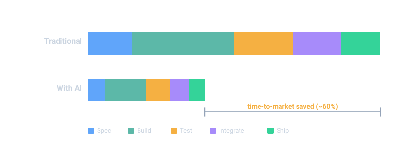
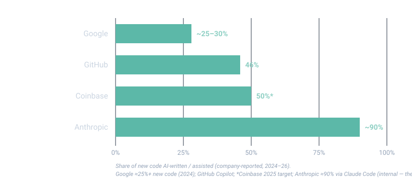

<!-- _class: lead -->
<!-- _paginate: false -->
<!-- _footer: '' -->

The state of AI across industry, the economy & trading

# AI & the Speed Moat

## Why time-to-market decides who wins — and how AI multiplies it

Prepared for Auros · internal discussion draft · June 2026

<!--
Speaker: Set the frame in one breath — this is not a hype tour. It's evidence that the firms compounding fastest are using AI to compress time-to-market, and that the lessons land directly on a crypto market maker. ~40 seconds.
-->

---

## The one idea

> Time-to-market is the most important metric in any trading or technology business. **Speed is the moat — and AI is now the multiplier.**

Across every function, AI is collapsing the cycle from idea → in-production. Everything else in this deck is evidence.

<!--
Speaker: Labour this. Two senses of "speed": how fast a trade executes (latency) and how fast you build/adapt/ship (time-to-market). This deck is about the second — the one that compounds. Say the thesis, point at the bar, move on.
-->

---

## The macro picture: the fastest diffusion we've seen

$500B+
/yr hyperscaler AI capex (reported, 2026)

~1.8%
potential US productivity-growth uplift (Anthropic)

55–80%
task time saved in controlled studies

<!--
Speaker: This is moving faster than cloud or mobile did. A quarter to a half of new code at leading firms is already AI-written. Don't over-claim the %s — definitions vary; that's why the footnote is there.
-->

---

## Four forces compressing time-to-market

### 1 · Productivity
Build faster with the people you already have.

### 2 · Autonomous building
Systems that build & run themselves.

### 3 · Cost reduction
Free resources, point them at speed.

### 4 · R&D
Out-iterate, don't just out-compute.

Evidence key: unbadged = verified/sourced · I inference (proprietary) · M myth-flagged. Full cites in <code>sources.md</code>.

<!--
Speaker: Give them the structure: four forces, then we land all of it on crypto trading. Each force ends on the same line — "and that is time-to-market compression."
-->

---

Force 1 / 4 · Developer & worker productivity

## AI is already rewriting how software gets built

- **GitHub Copilot** — 55% faster task completion (peer-reviewed)
- **Google** — ~25%+ of new code AI-generated (and rising)
- **Amazon Q** — $260M & ~4,500 dev-years saved on Java migration
- **Stripe "Minions"** — ~1,300 PRs shipped/week

- **JPMorgan LLM Suite** — 3–6 hrs/week saved per employee
- **Vodafone** — 3 hrs/week across 68k staff (M365 Copilot)
- **Anthropic** — 81% median time saved (internal study)
- **Moderna** — 750+ custom GPTs; "scale like a 100k-person co"

Sources: CACM (Copilot); AWS; Stripe eng; Microsoft; Anthropic; OpenAI case studies.

<!--
Speaker: Don't read every line — let the wall do the work. Pick two: Amazon Q ($260M is a real, audited-style number) and Copilot's peer-reviewed 55%. These are productivity, i.e. speed.
-->

---

Deep dive · Force 1

## Coinbase: AI coding as a mandate

- Every engineer **required** to adopt AI tools (Cursor, Copilot, Claude Code)
- **33%** of code AI-written (2025), targeting **50%**
- **51%** faster task completion (2h41 → 1h11)
- **84%** uplift in build success
- Mandatory **human review gate** retained

### Why this one
A **crypto-native** peer is treating AI dev-tooling as table-stakes — not a pilot.

The result is the same as everywhere else: **ship faster, keep the quality gate.**

Coinbase engineering blog; Fortune (CEO mandate, 2025).

<!--
Speaker: This is the slide for the room. A direct competitor-class crypto firm has made AI tooling mandatory. The 51% and the review-gate together = faster without lowering the bar.
-->

---

## …and that is time-to-market compression

- More output per engineer → features in **days, not sprints**
- **Augmentation, not headcount cuts** — redeploy freed time to alpha & differentiation
- The bottleneck shifts to **judgment and review** — your best people matter *more*

> Force 1: build faster with the people you already have.

<!--
Speaker: Hit the augmentation framing explicitly — engineer-heavy room. This is leverage, not layoffs. The scarce skill becomes taste and review.
-->

---

Force 2 / 4 · Autonomous system building

## Software — and machines — that build & run themselves

- **Devin (Cognition)** — autonomous PRs; ~25% of its own maker's code
- **Claude Code** — writes the majority of code at Anthropic
- **GitHub Copilot agent** — issue → PR; ~56% SWE-bench Verified
- **Factory / SWE-agents** — 50–70% on SWE-bench

- **Waymo** — 450k+ paid driverless rides/week
- **Figure @ BMW** — 99%+ accuracy; 90k+ parts placed
- **Amazon** — 1M+ warehouse robots; ~$12.6B projected savings
- **Agility Digit** — 100k+ totes moved in live ops

Sources: Cognition; Anthropic; GitHub; SWE-bench; Waymo; Figure/BMW; Amazon (Morgan Stanley est.); Agility.

<!--
Speaker: Two columns on purpose — code agents and physical robots are the same story: autonomy moving from demo to production in 2024–25. The savings figure is an analyst estimate; say so.
-->

---

Deep dive · Force 2

## Devin: legacy migration without the legacy timeline

- **Nubank** — autonomous migration of an 8-year, multi-million-line ETL monolith
- ~**12x** engineering-hours saved · ~**20x** cost · **weeks, not years**
- **Goldman Sachs** — deploying AI agents across a 12,000-person eng org (3–4x productivity)

### Why this one
"Legacy" used to mean *slow and risky to change.*

When an agent does the migration, the **build step itself** approaches near-zero time.

Nubank engineering case study; Bloomberg (Goldman Sachs deployment, 2025).

<!--
Speaker: The Nubank number is the one to land: years → weeks. This reframes legacy from "untouchable" to "cheap to replace" — which is the bridge to time-to-market.
-->

---

## …and that is time-to-market compression

- Commodity build & migration work approaches **near-zero cycle time**
- The model flips: from "human writes, bot assists" → **"bot builds, human approves"**
- Crypto is laying the **agent-native rails** now — Kraken CLI (MCP), OKX Agent Trade Kit, Coinbase AgentKit

> Force 2: ship systems faster than competitors can hand-build them.

<!--
Speaker: Tee up the crypto section lightly here — the exchanges are already building agent-ready infrastructure. Whoever's stack is agent-ready ships strategies fastest.
-->

---

Force 3 / 4 · Cost reduction

## Doing more with less — then reinvesting it

- **Klarna** — AI assistant ≈ 700 agents' work; −40% cost/transaction
- **Salesforce Agentforce** — $100M+ annualized savings
- **IBM AskHR** — −40% HR operating cost; ~$4.5B productivity

- **ServiceNow / Intercom Fin** — 80–90% case deflection
- **JPMorgan LOXM** — 15% better execution efficiency
- **Manufacturing** — predictive maintenance −25–40% maint. cost

OpenAI/Klarna; Salesforce; IBM; ServiceNow/Intercom; JPMorgan; McKinsey (mfg, aggregate). *Klarna re-added humans for edge cases in 2025.

<!--
Speaker: Use Klarna honestly — huge automation, but they recalibrated and added human capacity back for edge cases. That honesty is what makes the rest credible.
-->

---

## …and that is time-to-market compression

- Cost-out isn't the goal — **reallocating freed capacity & capital to move faster** is
- Augmentation-first: most leaders report **redeployment, not layoffs** (Klarna even reversed course on edge cases)
- Lower cost-to-build = **more shots on goal per quarter**

> Force 3: free up resources, point them at speed.

<!--
Speaker: Keep the room onside: the win is reinvesting savings into velocity, not cutting heads. Cheaper iteration = more iterations = faster to market.
-->

---

Force 4 / 4 · R&D

## AI is compressing the discovery loop

- **AlphaFold 3 / Isomorphic** — 2024 Nobel; AI-built drug pipelines
- **Insilico** — first AI-designed drug (target + molecule) at Phase IIa
- **DeepMind GNoME** — 2.2M materials; 736 lab-synthesised

- **AlphaChip** — AI floorplans across 3 TPU generations
- **GraphCast** — faster, more accurate 10-day weather
- **Fusion** — AI digital twins (Commonwealth + DeepMind)

Sources: DeepMind; Isomorphic; Insilico (Phase IIa, 2024); Microsoft (MatterGen); CFS.

<!--
Speaker: This is the "AI does real science now" wall — Nobel-grade, clinical-stage, production silicon. The point isn't biotech; it's that the discovery loop itself got faster.
-->

---

## …and that is time-to-market compression

- Discovery cycles collapse **years → weeks** — iteration speed becomes the moat
- In trading: **foundation models for time-series** (e.g. Kronos) and AI-accelerated quant research shorten the **strategy → production** loop

> Force 4: out-iterate, don't just out-compute.

<!--
Speaker: Bring R&D home to trading: the research-to-live-strategy pipeline is exactly the loop AI shortens. That's alpha velocity.
-->

---

<!-- _class: section -->
<!-- _paginate: false -->

# Crypto trading
## Where the speed moat is won or lost

<!--
Speaker: Pivot to the audience's world. Everything so far was the setup; this is the payload.
-->

---

## Two kinds of speed — don't confuse them

- **Latency** (µs): still matters, but plateauing — and crypto settles in **seconds**
- **Velocity** (time-to-market): how fast you build, adapt and ship — **compounding, AI-multiplied**
- The edge is migrating from the first to the second

<!--
Speaker: This is the reconciliation slide. Nobody's saying latency is dead — but in crypto it caps out fast. The durable, compounding edge is organisational velocity, and AI is the lever on it.
-->

---

## Your competitors are already on it

- **Wintermute** — ML risk/MM; 313% vol growth, ~$5B/day
- **GSR** — ML micro-spread & inventory routing I
- **Jump Crypto** — DL / RL / LLMs at scale
- **B2C2** — vector/time-series ML; $2T+ volume
- **Cumberland (DRW)** — DRW quant stack in crypto I

- **Keyrock** — ML stat-arb across 85+ venues I
- **Flowdesk** — 1M+ orders/day, low-latency infra
- **FalconX** — "Satoshi" LLM copilot; Focal AI insights
- **DWF Labs** — launched autonomous trading agents
- **Amber** — AgentFi on-chain automation

Most market-maker internals are proprietary — ML use is sourced from company statements/jobs; specifics are I inference.

<!--
Speaker: Name them — this is the motivating slide. The honest caveat (internals are private) protects you. The pattern is unmistakable: everyone in the peer set is investing in ML + agents.
-->

---

## The rails for AI agents are being laid now

- **Coinbase AgentKit** — lets agents transact on-chain; AI-coding mandate internally
- **Kraken CLI** — 134 commands, **MCP-native** for AI agents (live 2026)

- **OKX Agent Trade Kit** — 83 tools via MCP/CLI; OnchainOS across 60+ chains
- **Binance** — 100+ ML models (fraud); AI Pro sandbox; agent skills

> Whoever's infrastructure is **agent-ready** will ship AI strategies fastest. That is time-to-market, at the venue layer.

<!--
Speaker: The exchanges are building for an agent-first world. For a market maker, the read-through is: your own stack needs to be agent-ready or you'll integrate slower than rivals.
-->

---

## The frontier: on-chain AI agents — real revenue, real hype

**Real (on-chain, verifiable):**
- **Virtuals** — ~$479M Q1 on-chain agent activity
- **Bittensor** — ~$43M Q1 on-chain AI-services revenue
- **ai16z / ElizaOS** — open agent framework; fast adoption

### Stay skeptical
- "95% of crypto funds use agentic AI", "1M agents by EOY" — **forecast / hype** M
- Today: dominated by **speculative/meme** agents; institutional-grade still **early**
- Security: ~$4.6M of exploits surfaced by AI agents (2025)

Sources: Messari (Virtuals); 1kx (Bittensor); CryptoSlate. On-chain revenue verifiable; adoption forecasts M.

<!--
Speaker: Give them both barrels: the on-chain revenue is real and verifiable, but the "everything is an agent now" narrative is mostly hype. Credibility comes from drawing that line yourself.
-->

---

## The bar they're racing toward (TradFi quant)

- **XTX** — 25k GPUs, transformers, €1bn Kajaani build (Companies House, *not* HMRC)
- **Jane Street** — $6B CoreWeave AI commitment · **Bridgewater AIA** — $2B ML fund

- **Citadel** — entered crypto market-making (Feb 2025)
- **Renaissance / Man AHL** — decades of production ML
- *Myth:* "XTX built on the 2017 'Attention' paper" — founded **2015** M

Companies House; Data Centre Dynamics; CoinDesk; Fortune; corporate disclosures.

<!--
Speaker: TradFi is the sophistication bar — and it's pouring capital into compute and ML, while moving into crypto. Keep the myth correction; it signals rigour and pre-empts the one quant who knows XTX's founding date.
-->

---

## The speed moat

> Latency was the old moat. **Velocity is the new one** — and AI is how you compound it.

- All four forces point the same way: **less time from idea to in-production**
- In trading, the winners will **build, adapt and ship faster** than the field
- The advantage **compounds** — every cycle you save funds the next

<!--
Speaker: Land the thesis one more time. This is the sentence you want them repeating in the hallway afterward.
-->

---

## What this means for Auros

### Tool up
AI dev-tooling as a **mandate** (be Coinbase) — with review gates.

### Go agent-native
Build toward autonomous systems & **agent-ready rails**.

### Reinvest the savings
Turn cost-out into **funded speed** — more iterations per quarter.

### Compute & talent = moat
Treat both as strategic; the **best people matter more**, not less.

Every lever measured by one yardstick: time-to-market.

<!--
Speaker: Four concrete, fundable moves. Each maps to a force. Close by tying all of them back to the single metric.
-->

---

## Risks & honest caveats

- **Hype** — on-chain agents are early; separate signal from meme
- **Model risk** — silent failure, overfitting, regime breaks
- **Security / custody** — autonomous code near keys (~$4.6M exploits, 2025)

- **24/7 ops** — online models drift; monitoring is non-negotiable
- **Data caveats** — rival internals are inference; some 2026 stats are forecasts
- **Speed without judgment** — velocity only helps if the quality gate holds

<!--
Speaker: Showing the downside is what makes the upside land. Reiterate: speed is the moat, but ungated speed just ships mistakes faster.
-->

---

## Appendix · sources & method

- **Productivity / cost:** CACM (Copilot), AWS (Amazon Q), Stripe, Microsoft, IBM, OpenAI (Klarna/Moderna), Salesforce, ServiceNow
- **Autonomous / R&D:** Cognition, Anthropic, GitHub, Waymo, Figure, Amazon, DeepMind (AlphaFold/GNoME/AlphaChip/GraphCast), Insilico, CFS
- **Crypto & trading:** Wintermute, B2C2, Keyrock, Flowdesk, FalconX, DWF; Coinbase/Kraken/OKX/Binance; Messari/1kx (agents); XTX (Companies House), Jane Street, Bridgewater, Citadel
- **Macro:** hyperscaler capex (reported); Anthropic productivity research

Full URL list in <code>sources.md</code>. Key: unbadged = verified · I inference/insider · M myth-flagged. Figures approximate — verify headline numbers before presenting.

<!--
Speaker: Leave this up during Q&A. Point people to sources.md. Reiterate the verified-vs-inference discipline.
-->
